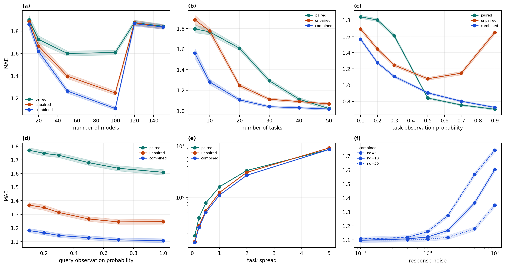

# Double-Kernel DKPS: Embedding Models from Partially-Observed Benchmarks

## 1. Motivation

The Data Kernel Perspective Space (DKPS) embeds black-box models into a low-dimensional space by comparing their responses to a shared set of queries. The resulting embedding captures model similarity in a way that is useful for downstream tasks like score prediction, model selection, and capability auditing.

**The limitation:** Standard DKPS requires a *paired* design — every model must respond to every query. In practice, benchmark evaluation is sparse: there are many models and many tasks, but each model has only been evaluated on a subset of tasks. For example, the HELM benchmark covers hundreds of models across dozens of tasks, but no single model has been run on all of them.

**The goal:** Extend DKPS to produce useful model embeddings from partially-observed benchmark data, where models have been evaluated on different (potentially non-overlapping) subsets of tasks.

## 2. The Product Kernel Approach

### 2.1 Standard DKPS (paired case)

In the fully paired setting, all $n$ models respond to the same $m$ queries. Let $x_{ij} = \text{embed}(\text{model}_i(\text{query}_j))$ be the response embedding. The DKPS squared distance between models $i$ and $k$ is:

$$D^2(i,k) = \frac{1}{m} \sum_{j=1}^{m} \|x_{ij} - x_{kj}\|^2$$

This can be rewritten using a kernel formulation. With linear response kernel $k_R(x, y) = x \cdot y$:

$$D^2(i,k) = A_{ii} + A_{kk} - 2 A_{ik}$$

where $A_{ab} = \frac{1}{m} \sum_j k_R(x_{aj}, x_{bj})$. Each $A$ term averages the kernel evaluation over queries that both models answered — which in the paired case is all of them.

### 2.2 Double-kernel extension (unpaired case)

When models answer different queries, we introduce a **query kernel** $k_Q$ that measures similarity between queries. The distance becomes:

$$D^2(i,k) = A_{ii} + A_{kk} - 2 A_{ik}$$

$$A_{ab} = \frac{\sum_{j \in Q_a} \sum_{l \in Q_b} k_Q(q_j, q_l) \cdot k_R(x_{aj}, x_{bl})}{\sum_{j \in Q_a} \sum_{l \in Q_b} k_Q(q_j, q_l)}$$

where $Q_a$ is the set of queries answered by model $a$, and $q_j$ is the query embedding for query $j$.

**Key properties:**

- When $k_Q = \delta$ (1 if same query, 0 otherwise) and all models share the same queries, this **reduces exactly to standard DKPS**.
- When $k_Q$ is an RBF kernel on query embeddings, responses to *similar* queries across different models contribute to the distance estimate, even if the models never answered the same query.
- Each $A$ term is separately normalized by its own query kernel mass $Z_{ab}$, handling different numbers of queries per model.

### 2.3 Three estimators

To isolate the contribution of shared vs. non-shared task information, we define three variants:

| Estimator | Queries used | What it measures |
|-----------|-------------|-----------------|
| **Paired** | Only from tasks shared by both models | Within-task signal only |
| **Unpaired** | Only from tasks unique to each model | Cross-task signal only |
| **Combined** | All queries from both models | Full signal |

All three use the same RBF query kernel. The difference is which queries participate in the $A$ terms. Combined uses everything; paired and unpaired partition the data by task overlap.

### 2.4 Downstream evaluation

The embedding is evaluated on its ability to predict held-out benchmark scores:

1. Fit `DoubleKernelDKPS` on observed response embeddings → pairwise distance matrix
2. Classical MDS → model embeddings in $\mathbb{R}^d$
3. For each held-out (model, task) pair: KNN regression in embedding space using observed scores from other models on that task
4. Report RMSE on held-out scores

## 3. Generative Model

### 3.1 Data generation

The synthetic benchmark is parameterized as follows:

**Latent structure:**
- Model offsets: $v_i \sim \mathcal{N}(0, I_{d})$, $i = 1, \ldots, n_{\text{models}}$
- Task vectors: $t_k \sim \mathcal{N}(0, \sigma_{\text{task}}^2 I_{d})$, $k = 1, \ldots, n_{\text{tasks}}$

**Scores:**
$$\text{score}(i, k) = v_i \cdot t_k + \epsilon, \quad \epsilon \sim \mathcal{N}(0, \sigma_{\text{score}}^2)$$

**Queries and responses:**
- Each task $k$ has $n_q$ queries: $q_{kj} = t_k + \eta_{kj}$, $\eta_{kj} \sim \mathcal{N}(0, \sigma_q^2 I_d)$
- Response embedding: $x_{ikj} = [q_{kj} + v_i + \xi_{ikj},\; \zeta_{ikj}]$
  - Active dimensions: query + model offset + noise $\xi \sim \mathcal{N}(0, \sigma_r^2 I_d)$
  - Extra dimensions: pure noise $\zeta \sim \mathcal{N}(0, I_{d_{\text{obs}} - d})$

**Observation pattern:**
- Task-level: each (model, task) pair observed independently with probability $p_{\text{task}}$
- Query-level: given task is observed, each query answered with probability $p_{\text{query}}$

### 3.2 Ground truth and recovery

In the limit of infinite queries with full observation, the DKPS distance converges to:

$$\mathbb{E}[\|x_{ij} - x_{kj}\|^2] = \|v_i - v_k\|^2 + C$$

where $C = 2\sigma_r^2 d + 2(d_{\text{obs}} - d)$ is a constant independent of the model pair. Classical MDS removes this constant via double-centering, recovering the true model geometry $\{v_i\}$ up to rotation.

The MDS embedding dimension is set to $d_{\text{latent}}$ (the true model dimension).

### 3.3 Expected results

The **combined** estimator should outperform paired and unpaired when:

1. **Task overlap is sparse** ($p_{\text{task}}$ low): Paired has few shared queries to work with. Combined supplements with cross-task signal via the query kernel.
2. **Tasks are similar** ($\sigma_{\text{task}}$ small): The RBF query kernel assigns meaningful weight to queries from different-but-similar tasks, enabling effective cross-task comparison.
3. **Many models, few tasks**: More models means sparser overlap per pair (expected shared tasks $\approx p_{\text{task}}^2 \cdot n_{\text{tasks}}$), amplifying the value of cross-task signal.

The combined estimator should **not** help when:
- Task overlap is high ($p_{\text{task}} \to 1$): Paired already has all the data it needs.
- Tasks are very dissimilar ($\sigma_{\text{task}}$ large): The query kernel can't meaningfully bridge across distant tasks.
- Too many models relative to tasks: The distance matrix becomes too noisy to embed, regardless of estimator.

### 3.4 Default parameters

| Parameter | Symbol | Default | Description |
|-----------|--------|---------|-------------|
| `d_latent` | $d$ | 5 | Latent dimension (model + task space) |
| `d_obs` | $d_{\text{obs}}$ | 20 | Observed embedding dimension |
| `n_models` | $n$ | 100 | Number of models |
| `n_tasks` | $K$ | 20 | Number of tasks |
| `n_queries_per_task` | $n_q$ | 10 | Queries per task |
| `obs_prob` | $p_{\text{task}}$ | 0.3 | Task observation probability |
| `query_obs_prob` | $p_{\text{query}}$ | 1.0 | Query observation probability |
| `score_noise` | $\sigma_{\text{score}}$ | 0.1 | Score noise |
| `response_noise` | $\sigma_r$ | 0.5 | Response embedding noise |
| `task_spread` | $\sigma_{\text{task}}$ | 1.0 | Task vector spread |
| `query_spread` | $\sigma_q$ | 0.5 | Within-task query spread |

The realistic regime is: many models (~100), moderate tasks (~20), low task parity (~0.3), high query completion (~1.0).

## 4. Experiments

All experiments use 50 random seeds. The metric is RMSE on held-out (model, task) score predictions via 5-NN in the DKPS embedding space. Each experiment sweeps one parameter while holding others at their defaults.

### 4.1 Number of models (panel a)

**Sweep:** $n_{\text{models}} \in \{10, 20, 50, 100, 120, 150\}$

| n_models | paired | unpaired | combined |
|----------|--------|----------|----------|
| 10 | 2.509 | 2.504 | **2.474** |
| 20 | 2.295 | 2.228 | **2.166** |
| 50 | 2.152 | 1.919 | **1.732** |
| 100 | 2.218 | 1.780 | **1.533** |
| 120 | 2.452 | 2.458 | 2.445 |
| 150 | 2.412 | 2.417 | 2.407 |

**Findings:** Combined improves monotonically up to 100 models, with the gap over paired growing from 0.035 (n=10) to 0.685 (n=100). At n=120+, all methods degrade sharply. This is a hard limit: with 20 tasks at $p_{\text{task}}=0.3$, each model sees ~6 tasks, and the expected shared tasks per pair is $0.3^2 \times 20 \approx 1.8$. At 120 models, the pairwise distance estimates become too noisy for MDS to recover the geometry (embedding-vs-true Spearman drops from 0.89 at n=100 to 0.05 at n=120).

### 4.2 Number of tasks (panel b)

**Sweep:** $n_{\text{tasks}} \in \{5, 10, 20, 30, 40, 50\}$

| n_tasks | paired | unpaired | combined |
|---------|--------|----------|----------|
| 5 | 2.383 | 2.464 | **2.076** |
| 10 | 2.351 | 2.381 | **1.761** |
| 20 | 2.218 | 1.780 | **1.533** |
| 30 | 1.813 | 1.521 | **1.437** |
| 40 | 1.586 | 1.494 | **1.424** |
| 50 | 1.427 | 1.462 | **1.403** |

**Findings:** More tasks benefits all methods. Combined's advantage is largest at few tasks (0.307 gap at n_tasks=5) and narrows as tasks increase (0.024 at n_tasks=50). At 50 tasks, the paired estimator nearly catches up because expected shared tasks per pair is $0.3^2 \times 50 = 4.5$ — enough direct overlap. Unpaired degrades at n_tasks=50 relative to paired because isolated task signal becomes noisier with more tasks spread across the same latent space.

### 4.3 Task parity (panel c)

**Sweep:** $p_{\text{task}} \in \{0.1, 0.2, 0.3, 0.5, 0.7, 0.9\}$

| obs_prob | paired | unpaired | combined |
|----------|--------|----------|----------|
| 0.1 | 2.421 | 2.357 | **2.088** |
| 0.2 | 2.383 | 2.055 | **1.747** |
| 0.3 | 2.218 | 1.780 | **1.533** |
| 0.5 | 1.184 | 1.518 | **1.270** |
| 0.7 | **1.060** | 1.640 | 1.124 |
| 0.9 | **0.985** | 2.200 | 1.013 |

**Findings:** This is the key panel. Combined wins decisively in the sparse regime ($p_{\text{task}} \leq 0.3$), with up to 30% lower RMSE than paired. The crossover occurs around $p_{\text{task}} = 0.5$: above this, paired catches up and eventually wins at $p_{\text{task}} = 0.9$ because most tasks are shared and there's no benefit to cross-task signal. Unpaired degrades at high overlap because its non-shared task pool shrinks.

### 4.4 Query sparsity (panel d)

**Sweep:** $p_{\text{query}} \in \{0.1, 0.2, 0.3, 0.5, 0.7, 1.0\}$

| query_obs_prob | paired | unpaired | combined |
|----------------|--------|----------|----------|
| 0.1 | 2.362 | 1.926 | **1.611** |
| 0.3 | 2.349 | 1.857 | **1.582** |
| 0.5 | 2.285 | 1.804 | **1.562** |
| 1.0 | 2.218 | 1.780 | **1.533** |

**Findings:** Within-task query sparsity has a modest effect. Combined is robust across the full range, maintaining its advantage even at $p_{\text{query}} = 0.1$. This confirms that the primary source of sparsity in real benchmarks (task-level, not query-level) is where the method matters most.

### 4.5 Task spread (panel e)

**Sweep:** $\sigma_{\text{task}} \in \{0.1, 0.25, 0.5, 1.0, 2.0, 5.0\}$

| task_spread | paired | unpaired | combined |
|-------------|--------|----------|----------|
| 0.10 | 0.248 | 0.189 | **0.173** |
| 0.25 | 0.566 | 0.406 | **0.354** |
| 0.50 | 1.115 | 0.816 | **0.703** |
| 1.00 | 2.218 | 1.780 | **1.533** |
| 2.00 | 4.432 | 4.176 | **3.687** |
| 5.00 | **11.077** | 11.896 | 11.263 |

**Findings:** When tasks are similar (low $\sigma_{\text{task}}$), the RBF query kernel can effectively bridge across tasks — combined's advantage is proportionally largest. The absolute RMSE scales with task spread because scores themselves scale as $v_i \cdot t_k \propto \sigma_{\text{task}}$. At $\sigma_{\text{task}} = 5$, tasks are so dissimilar that the cross-task signal adds noise, and paired begins to match combined.

### 4.6 Response noise x queries per task (panel f)

**Sweep:** $\sigma_r \in \{0.1, 0.5, 1.0, 2.0, 5.0, 10.0\}$ at $n_q \in \{3, 10, 50\}$, combined estimator only.

| response_noise | nq=3 | nq=10 | nq=50 |
|----------------|------|-------|-------|
| 0.1 | 1.535 | 1.530 | 1.525 |
| 0.5 | 1.546 | 1.533 | 1.525 |
| 1.0 | 1.585 | 1.547 | 1.529 |
| 2.0 | 1.711 | 1.595 | 1.539 |
| 5.0 | 2.061 | 1.816 | 1.602 |
| 10.0 | 2.284 | 2.102 | 1.768 |

**Findings:** More queries per task provides robustness to response noise. At low noise ($\sigma_r \leq 1$), all configurations perform similarly. At high noise ($\sigma_r = 10$), the gap between nq=3 and nq=50 is 0.516 RMSE — more queries average out the noise in the response embeddings. This suggests that in high-noise settings, increasing the number of queries per task is more valuable than adding more tasks.

## 5. Summary

The double-kernel DKPS with combined estimation consistently outperforms paired-only and unpaired-only estimators in the realistic benchmark regime: many models, sparse task overlap, complete query observation. The advantage is:

- **Largest** when task overlap is sparse ($p_{\text{task}} \leq 0.3$), tasks are similar, and there are many models relative to tasks.
- **Smallest** when overlap is abundant ($p_{\text{task}} \geq 0.7$) or tasks are very dissimilar ($\sigma_{\text{task}} \gg 1$).
- **Bounded** by the model-to-task ratio: at ~120 models with 20 tasks and $p_{\text{task}} = 0.3$, the distance estimates become too noisy for any method.

The method is simple (~190 lines), requires only query embeddings as additional input beyond standard DKPS, and reduces to standard DKPS as a special case when all tasks are shared.
